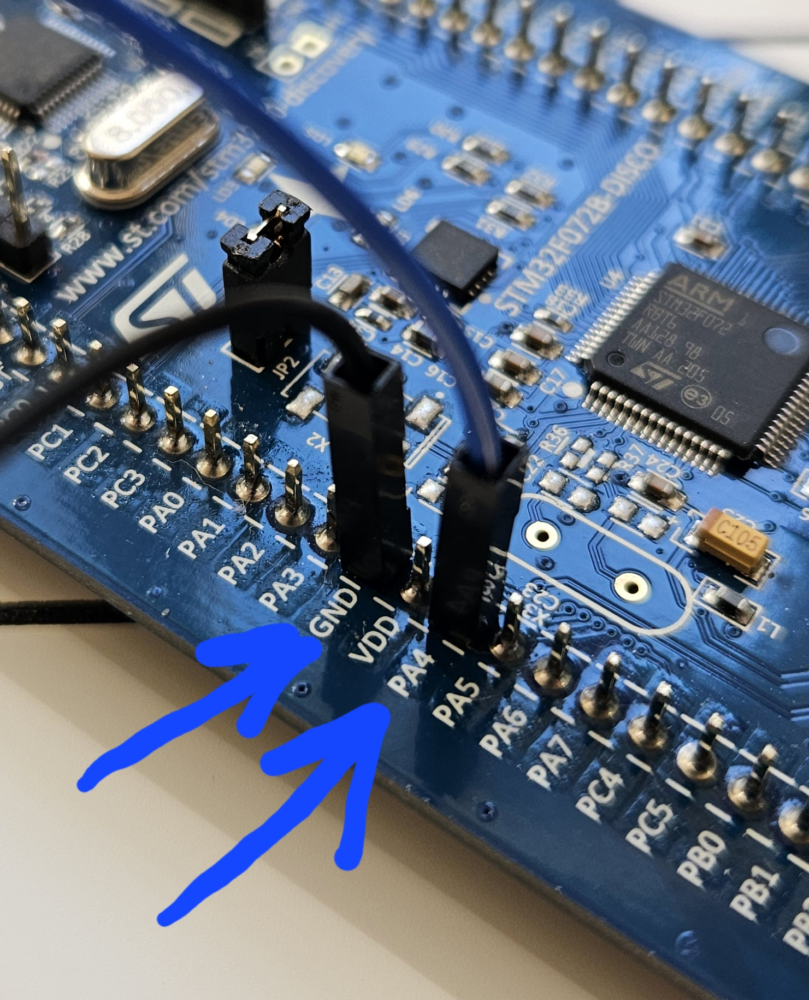

# daq-stm32f072

## Artefacts

Official documentation for the STM32F072RB microcontroller can be found at the following [link](https://www.st.com/en/microcontrollers-microprocessors/stm32f072rb.html)

Reference projects for the 072-discovery board can be found at the following [link](https://www.st.com/en/embedded-software/stsw-stm32139.html#overview)

Reference to development board can be found at the following [link](https://www.st.com/en/evaluation-tools/32f072bdiscovery.html)

## Getting Started

Connect PA4 to multimeter to measure the output voltage.
see the following picture for reference:

